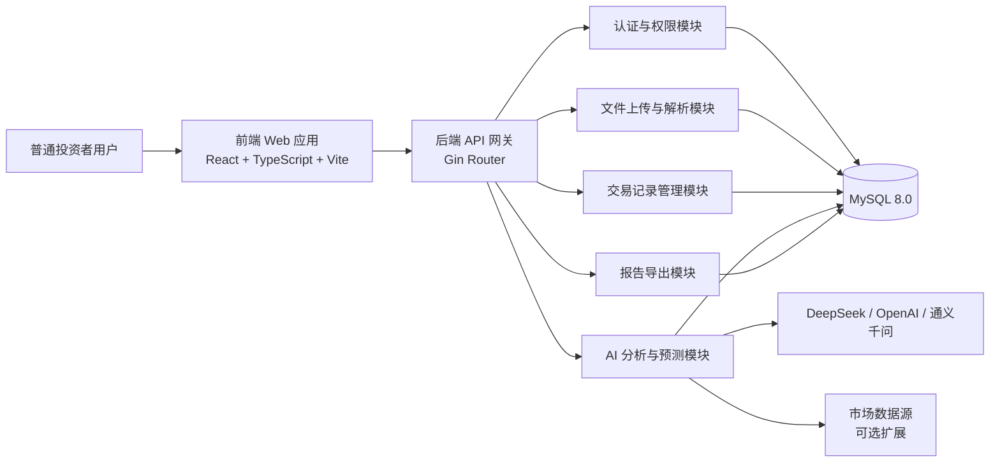
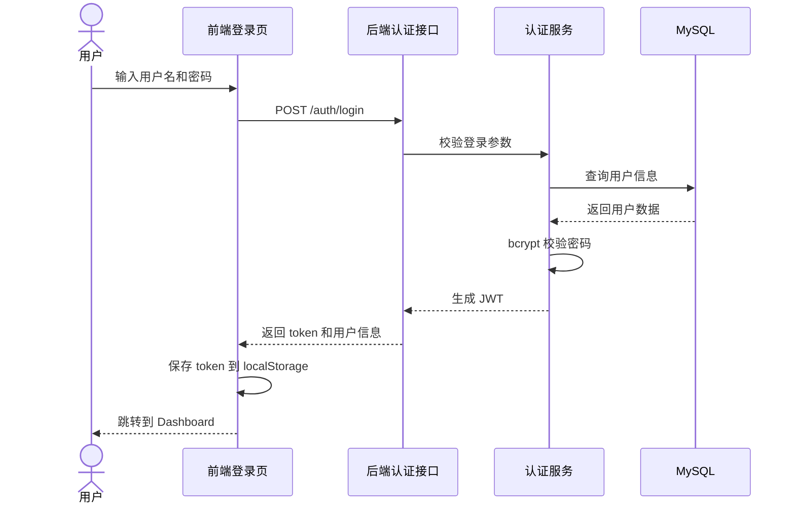
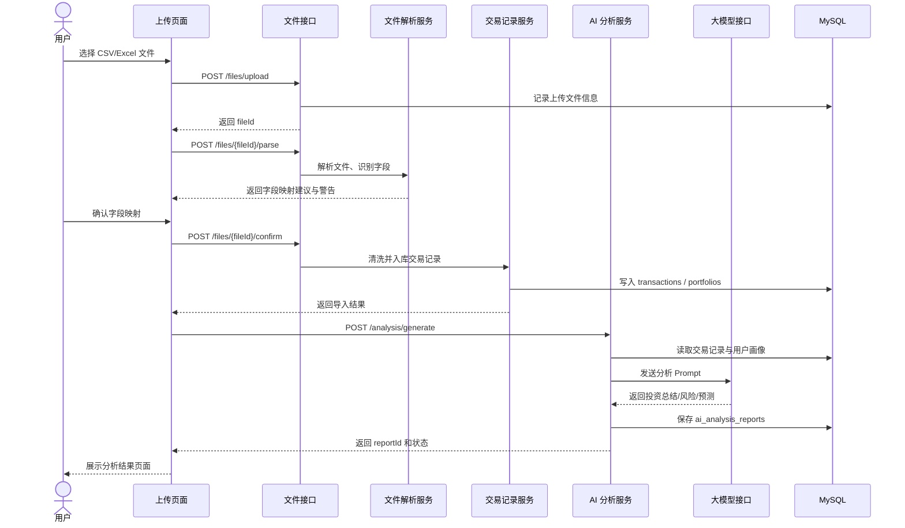
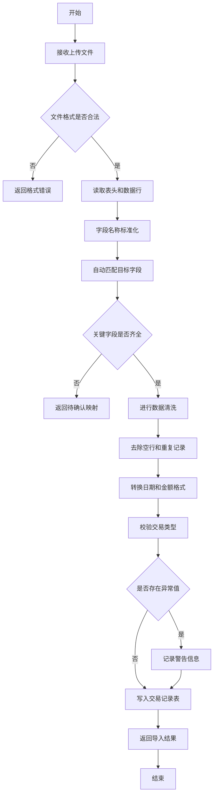
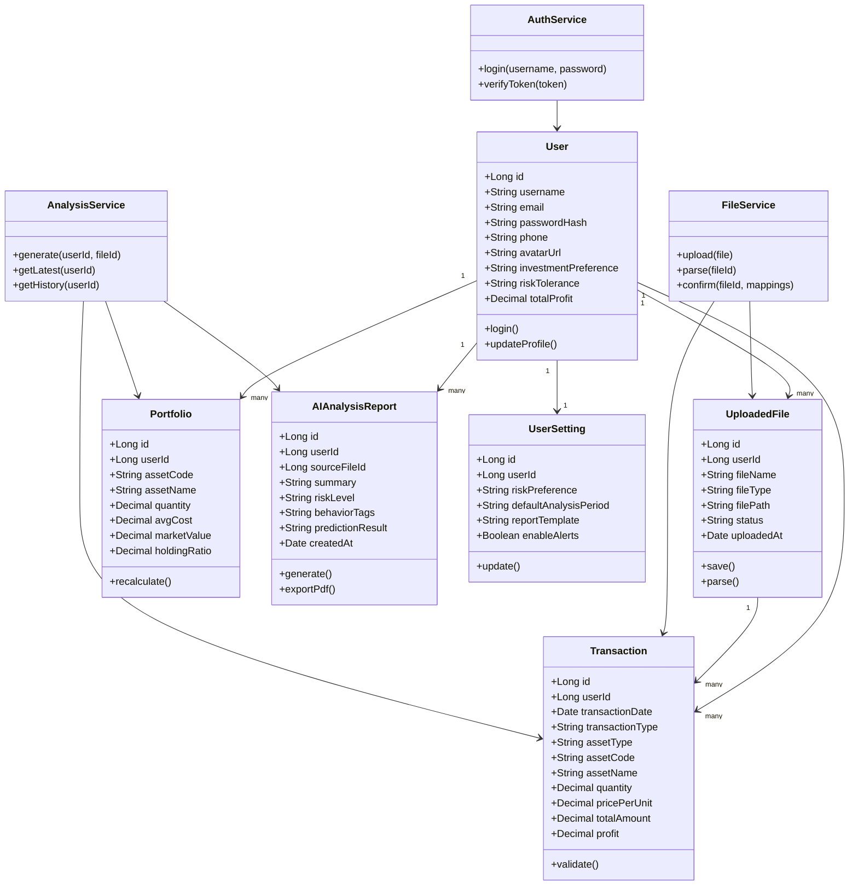

# 基于 AI 大模型的投资记录分析与预测 Web 应用

## 系统设计说明书

武汉大学计算机学院  
课程：计算机综合项目实践  
项目名称：基于 AI 大模型的投资记录分析与预测 Web 应用  
版本：V1.0  
日期：2026-03-22

---

## 前言

本文档用于描述“基于 AI 大模型的投资记录分析与预测 Web 应用”的系统设计方案，是项目从需求分析阶段进入详细实现阶段的重要技术文档。本文档结合已有需求文档、数据库设计文档、前端实现代码与接口设计文档，对系统的体系架构、功能结构、核心流程、类设计、接口设计、数据库设计与 UI 设计进行统一说明。

本文档的目标读者包括：

1. 项目组前端开发成员
2. 项目组后端开发成员
3. 测试与文档成员
4. 指导教师与课程评审人员

### 0.1 编写目的

本文档的主要目的如下：

1. 明确系统整体设计方案与模块划分
2. 为前后端分工协作提供统一依据
3. 为数据库实现、接口联调与页面实现提供参考
4. 为后续系统测试、优化和答辩展示提供设计支撑

### 0.2 设计依据

本文档主要基于以下材料整理：

1. 项目需求文档
2. 需求分析与数据库设计文档
3. 当前前端实现代码 `frontend`
4. 项目接口设计文档 `frontend2/API_INTERFACE.md`

### 0.3 术语说明

| 术语 | 含义 |
|------|------|
| AI 投顾助手 | 本项目系统名称 |
| LLM | 大语言模型，如 DeepSeek、OpenAI、通义千问 |
| Dashboard | 首页总览页面 |
| JWT | 用于登录鉴权的令牌 |
| RESTful API | 后端提供的资源风格接口 |
| Portfolio | 用户当前持仓汇总信息 |

---

## 1. 系统体系架构

本系统采用前后端分离架构，整体由表示层、业务层、数据层、外部 AI 服务层四部分组成。前端负责用户交互与可视化展示，后端负责认证、文件处理、投资记录管理、AI 分析调度与报告生成，数据库负责持久化存储，外部大模型负责生成分析结论与趋势预测。

### 1.1 总体架构说明



图 1-1 系统总体架构图

### 1.2 分层架构

1. 表示层
   包括 `frontend` 中的登录页、总览页、上传页、分析页、预测页、历史页。
2. 接口层
   由 Gin 提供 RESTful API，统一处理前端请求、参数校验、权限认证与响应封装。
3. 业务层
   包括用户认证、文件解析、交易记录处理、AI 分析、预测生成、报告导出等核心业务逻辑。
4. 数据层
   使用 MySQL 存储用户、交易记录、上传文件、持仓信息、分析报告、用户设置等数据。
5. 外部服务层
   负责接入大模型 API 与可能扩展的市场行情数据接口。

### 1.3 前端架构

当前实际使用的前端位于 `frontend` 目录，采用 React Router + Ant Design 组件化结构，核心代码结构如下：

```text
App
└── RouterProvider
    ├── Login
    └── ProtectedRoute
        └── MainLayout
            ├── Sider Menu
            ├── Header
            └── Pages
                ├── Dashboard
                ├── Upload
                ├── Analysis
                ├── Prediction
                └── History
```

图 1-2 前端组件组织结构

其中，`MainLayout` 统一负责左侧导航、顶部栏和内容区渲染，页面组件只负责各自业务内容展示。当前部分页面使用静态示例数据或占位内容，后续将逐步替换为真实 API 调用。

### 1.4 后端架构建议

后端建议采用分模块结构：

```text
backend/
├── cmd/
├── config/
├── router/
├── controller/
├── service/
├── repository/
├── model/
├── middleware/
├── utils/
└── docs/
```

各层职责如下：

- `controller`：接收 HTTP 请求、参数绑定、响应输出
- `service`：封装业务逻辑
- `repository`：数据库读写
- `model`：领域实体与数据库模型
- `middleware`：JWT、日志、异常恢复、跨域等

---

## 2. 系统功能结构（层次结构）

根据需求分析，系统功能可分为八个一级模块。

### 2.1 功能结构树

```text
AI 投顾助手系统
├── 1. 用户与认证管理
│   ├── 用户登录
│   ├── 获取当前用户信息
│   ├── 退出登录
│   └── 权限校验
├── 2. 投资记录导入管理
│   ├── 文件上传
│   ├── 文件格式校验
│   ├── 字段智能识别
│   ├── 字段映射确认
│   ├── 数据清洗
│   └── 数据入库
├── 3. 交易记录管理
│   ├── 交易记录查询
│   ├── 交易记录详情查看
│   ├── 手动新增交易
│   ├── 修改交易记录
│   └── 删除交易记录
├── 4. 首页总览分析
│   ├── 总资产统计
│   ├── 近 30 日盈亏
│   ├── 持仓结构展示
│   ├── 趋势数据展示
│   └── 风险提醒
├── 5. AI 分析报告
│   ├── 投资总结
│   ├── 投资偏好分析
│   ├── 风险等级评估
│   ├── 行为模式识别
│   └── 风险预警建议
├── 6. 趋势预测
│   ├── 历史收益趋势展示
│   ├── AI 未来趋势预测
│   ├── 情景分析
│   └── 预测置信度展示
├── 7. 报告管理
│   ├── 历史分析记录查询
│   ├── 指定报告查看
│   └── PDF 导出
└── 8. 用户设置
    ├── 风险偏好设置
    ├── 默认分析周期设置
    ├── 报告模板设置
    └── 提醒开关设置
```

图 2-1 系统功能结构树

### 2.2 功能与页面映射关系

| 前端页面 | 主要功能 | 对应后端模块 |
|------|------|------|
| Login | 登录、登录态初始化 | 认证模块 |
| Dashboard | 资产总览、持仓分布、风险提醒 | Dashboard 模块 |
| Upload | 文件上传、字段识别、导入流程 | 文件上传模块 |
| Analysis | AI 总结、行为识别、风险分析 | AI 分析模块 |
| Prediction | 趋势预测、情景分析 | 预测模块 |
| History | 历史记录查询、筛选、归档 | 交易记录与报告模块 |

---

## 3. 系统用例的时序图（顺序图）以及说明

### 3.1 用例一：用户登录

#### 时序图



图 3-1 用户登录时序图

#### 说明

1. 用户在登录页输入用户名和密码。
2. 前端向认证接口发送登录请求。
3. 后端在认证服务中完成参数校验与用户查询。
4. 使用 bcrypt 验证密码后生成 JWT。
5. 前端保存 token，并进入受保护页面。

该时序图体现了系统中最基础的认证链路，是其他业务功能的前置条件。

### 3.2 用例二：上传投资记录并生成 AI 分析

#### 时序图



图 3-2 上传投资记录并生成 AI 分析时序图

#### 说明

1. 用户上传投资记录文件。
2. 后端先保存原始文件信息，再进行字段识别。
3. 用户确认映射规则后，系统对数据进行清洗和入库。
4. 后端读取交易记录与画像数据，调用大模型生成分析结果。
5. 最终分析结果写入数据库，并在前端分析页中展示。

该用例是系统的核心业务链路，覆盖了上传、解析、入库、分析和展示的完整流程。

---

## 4. 复杂功能的算法设计

本系统中复杂度较高的功能主要有两个：文件解析与清洗、AI 分析与趋势预测。

### 4.1 功能一：投资记录文件解析与清洗

#### 流程图



图 4-1 投资记录文件解析与清洗流程图

#### 伪代码

```text
function parseAndImport(file):
    if file.type not in [csv, xls, xlsx]:
        return error("unsupported file type")

    rows = readFile(file)
    headers = normalizeHeaders(rows.headers)
    mappings = autoMap(headers)

    if not hasRequiredFields(mappings):
        return {
            status: "pending_confirm",
            mappings: mappings
        }

    cleanedRows = []
    warnings = []

    for row in rows.data:
        if isEmpty(row):
            continue
        if isDuplicate(row):
            continue

        normalized = normalizeRow(row, mappings)

        if not isValidTransactionType(normalized.type):
            warnings.append("invalid transaction type")
            continue

        if hasAbnormalValue(normalized):
            warnings.append("abnormal value detected")

        cleanedRows.append(normalized)

    saveTransactions(cleanedRows)
    return success(cleanedRows.count, warnings)
```

#### 设计说明

- 该算法兼顾自动识别与人工确认，适合处理不同券商或用户导出的 Excel/CSV 文件。
- 关键点在于字段标准化、容错处理和异常警告记录。
- 该流程既能满足课程项目需要，也能为后续真实部署留下扩展空间。

### 4.2 功能二：AI 分析与趋势预测生成

#### 算法思路

1. 从数据库读取指定用户的历史交易记录、持仓分布、收益曲线和风险偏好。
2. 对数据进行聚合，提取总资产、收益率、持仓集中度、交易频率、盈亏分布等特征。
3. 将结构化特征与业务问题模板拼装成 Prompt。
4. 调用大模型生成投资总结、风险等级、行为模式识别和趋势预测。
5. 对模型返回结果进行格式化、清洗和可信度评分。
6. 落库到分析报告表，并返回前端展示。

#### 伪代码

```text
function generateAnalysis(userId):
    transactions = queryTransactions(userId)
    portfolio = queryPortfolio(userId)
    profile = queryUserProfile(userId)

    features = {
        totalProfit: calcTotalProfit(transactions),
        monthlyTrend: calcMonthlyTrend(transactions),
        concentration: calcHoldingConcentration(portfolio),
        frequency: calcTradeFrequency(transactions),
        behaviorPattern: detectBehaviorPattern(transactions)
    }

    prompt = buildPrompt(profile, features)
    llmResult = callLLM(prompt)

    analysisResult = formatResult(llmResult, features)
    saveAnalysisReport(userId, analysisResult)

    return analysisResult
```

#### 设计说明

- 该算法采用“规则特征提取 + 大模型解释生成”的混合方式。
- 规则计算部分保证基础指标可信，大模型负责自然语言总结与综合建议。
- 这样可以降低纯生成式模型的不稳定性，提高结果可解释性。

---

## 5. 面向对象方法类图的详细设计

本系统后端可按领域对象进行建模，前端则以页面组件和路由组件组织。以下类图以系统核心实体与服务为中心展开。

### 5.1 领域类图



图 5-1 系统核心领域类图

### 5.2 类职责说明

| 类名 | 职责 |
|------|------|
| User | 存储用户基础信息、风险偏好和累计盈亏 |
| UploadedFile | 保存上传文件元数据与处理状态 |
| Transaction | 存储投资交易明细 |
| Portfolio | 记录当前持仓汇总信息 |
| AIAnalysisReport | 存储 AI 生成的分析报告与预测结果 |
| UserSetting | 存储用户个性化配置 |
| AuthService | 处理登录、Token 验证 |
| FileService | 处理上传、解析、清洗与导入 |
| AnalysisService | 负责大模型调用与分析报告生成 |

### 5.3 前端组件设计

前端组件可划分为三类：

1. 页面组件
   `Login`、`Dashboard`、`Upload`、`Analysis`、`Prediction`、`History`
2. 布局组件
   `Layout(MainLayout)`
3. 功能组件
   `ProtectedRoute`

当前前端更多依赖 Ant Design 的现成组件进行界面组织，例如 `Layout`、`Menu`、`Card`、`Table`、`Form`、`Upload.Dragger`、`Statistic` 等。这种设计能够快速形成统一视觉风格，并降低页面开发成本。

---

## 6. 接口设计

接口设计采用 RESTful 风格，前端通过 `/api/v1` 前缀访问后端服务。完整字段说明可参考项目中的 API 文档，这里给出系统设计层面的主接口划分。

说明：

- 本章以系统设计层面的接口划分和约定为主
- 更细粒度的请求参数表与返回字段表可参考 `frontend2/API_INTERFACE.md`
- 正式实现时建议同步生成 Swagger / OpenAPI 文档

### 6.1 接口分组

| 模块 | 主要接口 |
|------|------|
| 认证模块 | `POST /auth/login`、`GET /auth/me`、`POST /auth/logout` |
| Dashboard 模块 | `GET /dashboard/summary`、`GET /dashboard/portfolio`、`GET /dashboard/trend`、`GET /dashboard/alerts` |
| 文件模块 | `POST /files/upload`、`POST /files/{fileId}/parse`、`POST /files/{fileId}/confirm`、`GET /files/history` |
| 交易模块 | `GET /transactions`、`GET /transactions/{id}` |
| AI 分析模块 | `POST /analysis/generate`、`GET /analysis/latest`、`GET /analysis/history`、`GET /analysis/{reportId}` |
| 预测模块 | `GET /prediction/latest`、`POST /prediction/generate` |
| 报告模块 | `GET /reports/{reportId}/export` |
| 设置模块 | `GET /settings`、`PUT /settings` |

### 6.2 通用接口设计原则

1. 响应结构统一为 `code + message + data`
2. 列表接口统一支持分页
3. 登录后接口统一带 `Authorization: Bearer <token>`
4. 时间字段统一使用 ISO 8601 字符串
5. 枚举值统一使用固定英文标识，例如 `buy`、`sell`、`dividend`

### 6.3 示例接口：登录

#### 请求

```http
POST /api/v1/auth/login
Content-Type: application/json
```

```json
{
  "username": "盛哲",
  "password": "123456"
}
```

#### 响应

```json
{
  "code": 0,
  "message": "ok",
  "data": {
    "token": "jwt-token-demo",
    "user": {
      "id": 1,
      "username": "盛哲",
      "riskTolerance": "medium"
    }
  }
}
```

### 6.4 示例接口：上传解析文件

#### 上传文件

```http
POST /api/v1/files/upload
Content-Type: multipart/form-data
```

#### 解析文件

```http
POST /api/v1/files/{fileId}/parse
```

#### 设计重点

- 上传与解析分离，方便支持大文件与异步处理
- 字段映射结果允许前端确认，提升兼容性
- 解析结果需返回警告信息，便于用户发现异常数据

---

## 7. 数据库物理设计

根据需求分析与数据库设计文档，系统数据库采用 MySQL 8.0，字符集建议使用 `utf8mb4`，存储引擎使用 `InnoDB`。

### 7.1 主要数据表

| 表名 | 用途 |
|------|------|
| users | 用户基础信息 |
| transactions | 交易记录 |
| portfolios | 当前持仓信息 |
| ai_analysis_reports | AI 分析报告 |
| uploaded_files | 上传文件记录 |
| market_data | 市场行情数据 |
| user_settings | 用户个性化设置 |

### 7.2 关键表物理设计摘要

#### users

| 字段名 | 类型 | 约束 | 说明 |
|------|------|------|------|
| id | BIGINT | PK, AUTO_INCREMENT | 用户 ID |
| username | VARCHAR(50) | UNIQUE, NOT NULL | 用户名 |
| email | VARCHAR(100) | UNIQUE, NOT NULL | 邮箱 |
| password_hash | VARCHAR(255) | NOT NULL | 密码哈希 |
| investment_preference | ENUM | DEFAULT 'balanced' | 投资偏好 |
| risk_tolerance | VARCHAR(10) | DEFAULT 'medium' | 风险承受能力 |
| total_profit | DECIMAL(15,2) | DEFAULT 0 | 累计盈亏 |

#### transactions

| 字段名 | 类型 | 约束 | 说明 |
|------|------|------|------|
| id | BIGINT | PK | 交易 ID |
| user_id | BIGINT | FK, NOT NULL | 所属用户 |
| transaction_date | DATE | NOT NULL | 交易日期 |
| transaction_type | ENUM | NOT NULL | 买入/卖出/分红 |
| asset_code | VARCHAR(20) | NOT NULL | 资产代码 |
| asset_name | VARCHAR(100) | NOT NULL | 资产名称 |
| quantity | DECIMAL(10,2) | NOT NULL | 数量 |
| price_per_unit | DECIMAL(10,2) | NOT NULL | 单价 |
| total_amount | DECIMAL(15,2) | NOT NULL | 总金额 |
| profit | DECIMAL(15,2) | NULL | 盈亏 |

#### ai_analysis_reports

| 字段名 | 类型 | 约束 | 说明 |
|------|------|------|------|
| id | BIGINT | PK | 报告 ID |
| user_id | BIGINT | FK | 用户 ID |
| source_file_id | BIGINT | FK | 来源文件 ID |
| summary | TEXT | NOT NULL | AI 总结 |
| risk_level | VARCHAR(10) | NOT NULL | 风险等级 |
| behavior_tags | JSON/TEXT | NULL | 行为标签 |
| prediction_result | JSON/TEXT | NULL | 预测结果 |
| created_at | TIMESTAMP | DEFAULT CURRENT_TIMESTAMP | 创建时间 |

### 7.3 索引设计

| 表名 | 索引 | 作用 |
|------|------|------|
| users | `idx_username`、`idx_email` | 支持登录与用户查询 |
| transactions | `idx_user_date(user_id, transaction_date)` | 提高用户历史交易查询效率 |
| transactions | `idx_asset_code(asset_code)` | 支持资产维度查询 |
| uploaded_files | `idx_user_uploaded_at(user_id, uploaded_at)` | 支持上传历史查询 |
| ai_analysis_reports | `idx_user_created_at(user_id, created_at)` | 支持历史报告查询 |

### 7.4 数据库设计说明

1. 用户表与交易表、持仓表、报告表、上传文件表均为一对多关系。
2. 使用外键保证数据一致性。
3. 对高频查询字段建立联合索引，提高 Dashboard、历史记录、分析报告查询效率。
4. 报告与预测结果可以先以 `TEXT/JSON` 存储，便于快速迭代。

### 7.5 数据库设计原则

1. 满足第三范式要求，减少冗余数据
2. 对核心高频查询路径建立索引
3. 对用户相关数据采用 `user_id` 做逻辑隔离
4. 对分析报告和预测结果保留一定的非结构化扩展能力
5. 为后续市场行情接入和多模型扩展预留字段空间

---

## 8. UI（界面）设计

### 8.1 设计目标

本系统 UI 设计目标如下：

1. 面向非专业投资者，强调简洁、易理解
2. 使用清晰的信息分区降低阅读成本
3. 兼顾 PC 端展示效果与移动端适配
4. 方便课程答辩展示和后续接口联调

### 8.1.1 设计原则

1. 一致性原则：导航、色彩、间距和组件风格保持统一
2. 可理解性原则：信息分组清晰，减少用户认知负担
3. 可扩展性原则：便于后续接入图表、接口、状态反馈组件
4. 可实现性原则：优先采用成熟组件库提升开发效率

### 8.2 界面风格设计

当前 `frontend` 的界面设计特点：

- 基于 Ant Design 的后台管理风格界面
- 左侧采用可折叠深色侧边导航栏
- 顶部使用白色 Header 展示页面标题、连接状态和用户操作入口
- 内容区大量使用 Card、Table、Statistic、Alert、Timeline 等标准组件
- 登录页采用居中卡片式布局，强调简洁和快速进入系统
- 整体风格统一、规范，便于后续快速接入真实业务数据

### 8.3 页面设计说明

#### 登录页

主要元素：

- 系统标题
- 用户名输入框
- 密码输入框
- 登录按钮
- 登录成功提示消息

设计目的：

- 以最简洁的表单界面完成用户身份验证
- 减少初始操作成本，提升可用性

对应实现：

- 使用 Ant Design 的 `Card`、`Form`、`Input`、`Button`
- 登录成功后使用 `message.success` 给出反馈

#### Dashboard 首页

主要区域：

- 顶部统计卡片区
- 收益趋势图占位区
- 数据总览卡片区

设计目的：

- 让用户在一个页面内获得投资全貌
- 支持后续接入真实图表组件和更多统计指标

对应实现：

- 使用 `Row`、`Col`、`Card`、`Statistic` 组织指标区

#### 上传页

主要区域：

- 拖拽上传区
- 上传卡片标题区

设计目的：

- 降低文件导入门槛
- 提供统一的文件导入入口

对应实现：

- 使用 `Upload.Dragger` 提供拖拽上传入口

#### AI 分析页

主要区域：

- 标题区
- 行为模式识别时间线
- 风险等级卡片
- 风险建议标签

设计目的：

- 将 AI 分析结果用 Timeline、Tag 和 Card 的形式进行结构化表达

对应实现：

- 使用 `Timeline` 表示行为模式识别过程
- 使用 `Tag` 强调风险建议

#### 趋势预测页

主要区域：

- 标题区
- 风险提示 Alert
- ECharts 趋势图区域

设计目的：

- 使用图表直观展示未来收益模拟结果
- 强调预测仅供参考，不构成投资建议

对应实现：

- 使用 `Alert` 显示风险提示
- 使用 `ReactECharts` 展示折线趋势图

#### 历史记录页

主要区域：

- 交易历史表格
- 盈亏颜色区分
- 分页功能

设计目的：

- 便于回顾历史交易、上传与分析记录

对应实现：

- 使用 `Table` 展示历史记录
- 通过颜色区分盈亏正负值

### 8.4 UI 原型与代码映射

| 页面 | 代码位置 |
|------|------|
| 登录页 | `frontend/src/pages/Login.tsx` |
| 首页 | `frontend/src/pages/Dashboard.tsx` |
| 上传页 | `frontend/src/pages/Upload.tsx` |
| 分析页 | `frontend/src/pages/Analysis.tsx` |
| 预测页 | `frontend/src/pages/Prediction.tsx` |
| 历史页 | `frontend/src/pages/History.tsx` |
| 布局页 | `frontend/src/components/layout/Layout.tsx` |
| 路由守卫 | `frontend/src/components/ProtectedRoute.tsx` |

### 8.5 响应式设计

系统前端使用响应式布局，主要策略如下：

1. 宽屏下采用左侧 `Sider` + 右侧内容区布局
2. Ant Design 的 `Row`、`Col` 组件支持栅格化内容排版
3. 表格组件支持分页，后续可进一步启用横向滚动
4. 侧边栏支持 `collapsible` 折叠，提升小屏场景可用性

---

## 9. 设计总结

本系统设计以“前后端分离 + AI 能力集成 + 面向普通投资者”的思路展开，具备以下特点：

1. 架构清晰，便于模块化开发与分工协作
2. 功能闭环完整，覆盖上传、分析、预测、导出主流程
3. 接口规范明确，适合前后端联调
4. 数据库结构稳定，支持后续扩展
5. UI 原型已在 `frontend` 中落地，采用 Ant Design 组件化方式，具备较好的规范性与扩展价值

当前系统前端 demo 已完成基础界面设计，后续重点工作包括：

- 接入真实后端 API
- 完善 Dashboard 的统计卡片与图表内容
- 完善文件解析与上传进度
- 完成 PDF 导出与报告查看
- 加强权限控制、异常处理与系统安全设计

至此，系统已经具备从需求分析进入详细实现阶段的设计基础。

---

## 10. 附录

### 10.1 相关文档

| 文档名称 | 用途 |
|------|------|
| `README.md` | 项目总体说明 |
| `frontend/README.MD` | 前端模块说明 |
| `frontend2/README.MD` | 原型版本说明与联调参考 |
| `frontend2/API_INTERFACE.md` | 接口字段级设计参考 |
| `需求分析与数据库设计.md` | 需求与数据库设计依据 |

### 10.2 后续完善方向

1. 将时序图、流程图和类图同步整理为答辩 PPT 版本
2. 将接口文档升级为 Swagger/OpenAPI 标准格式
3. 在系统实现后补充详细设计与测试设计文档
4. 对 AI 分析结果补充可解释性与置信度评估说明
